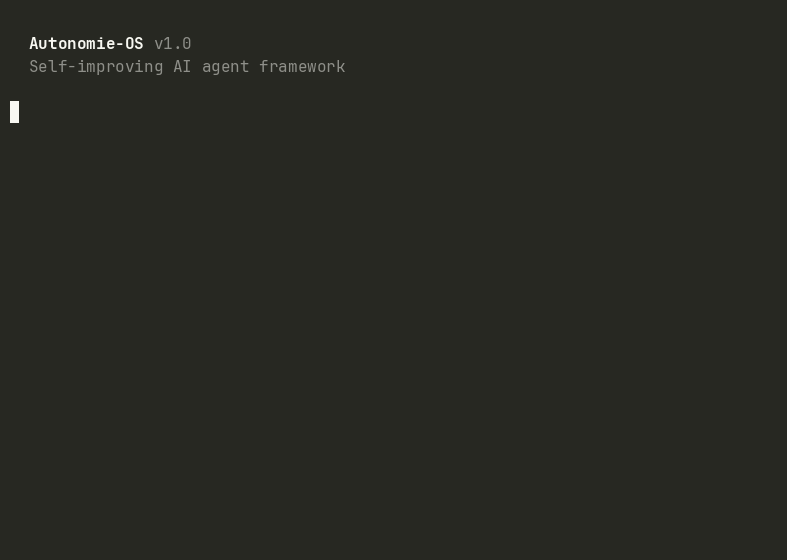

<h1 align="center">
  <br>
  
  <br>
  The self-improving AI agent framework.
  <br>
</h1>

<p align="center">
  <a href="https://github.com/FvdHMBAI/autonomie-os/actions"></a>&nbsp;
  <a href="https://github.com/FvdHMBAI/autonomie-os/stargazers"></a>&nbsp;
  <a href="LICENSE"></a>
</p>

<p align="center">
  <a href="#the-story">Story</a> · 
  <a href="#quick-start">Quick Start</a> · 
  <a href="#how-it-compares">Comparison</a> · 
  <a href="#modules">Modules</a> · 
  <a href="#architecture">Architecture</a> · 
  <a href="#the-agentstack-ecosystem">Ecosystem</a>
</p>

---

## The Story

Our AI agent made the same mistake three times in one week. Every time it deployed a new container, it forgot to connect it to the Docker network. Every time, the app returned 502 for fifteen minutes until someone noticed.

The third time, the agent fixed itself. Not because we wrote a new rule. Because Autonomie OS had analyzed the first two failures overnight, extracted a playbook, and injected it as context for the next session.

That's the difference between a tool and a system that learns. A tool does what you tell it. Autonomie OS remembers what went wrong and makes sure it doesn't happen again.

```
  ┌──────────────────────────────────────────────────────────────┐
  │  Autonomie OS: Nightly Report                                │
  │                                                              │
  │  Sessions analyzed:   8                                      │
  │  Patterns detected:   3 (2 new, 1 recurring)                │
  │  Playbooks written:   2                                      │
  │  Skills improved:     1 (deployment: +network connect step)  │
  │  Regressions found:   0                                      │
  │                                                              │
  │  198 feedback rules crystallized from agent experience.      │
  └──────────────────────────────────────────────────────────────┘
```

<p align="center">
  
</p>

---

<table>
  <tr>
    <td align="center"><strong>198</strong><br><sub>Crystallized Rules</sub></td>
    <td align="center"><strong>61</strong><br><sub>Active Skills</sub></td>
    <td align="center"><strong>73</strong><br><sub>Auto-generated Learnings</sub></td>
    <td align="center"><strong>89%</strong><br><sub>Autonomous Task Success Rate</sub></td>
  </tr>
</table>

<p align="center"><sub>Numbers from a live production system. Every rule was extracted from real agent behavior, not written by a human.</sub></p>

---

## How It Compares

Most AI frameworks help agents *do things*. Autonomie OS helps agents *become better at doing things*.

| Framework | What it does | What it doesn't |
|-----------|-------------|-----------------|
| **AutoGPT** | Executes tasks autonomously | Doesn't learn from mistakes |
| **LangChain** | Chains LLM calls into workflows | No self-improvement loop |
| **CrewAI** | Multi-agent orchestration | No overnight learning |
| **Devin** | AI software engineer ($500/mo) | Closed source, cloud-only |
| **Autonomie OS** | **Learns from every session. Improves overnight. Runs on your hardware.** | |

The difference between a tool and an organism is that an organism adapts.

## Quick Start

### Prerequisites

- bash 4+, jq, python3
- PostgreSQL (for learning storage)
- One of: Ollama (free), Claude API key, or OpenAI API key

### Install

```bash
git clone https://github.com/FvdHMBAI/autonomie-os.git
cd autonomie-os && ./install.sh
```

### Configure

```bash
autonomie init
# Creates ~/.autonomie/config.json
# Sets up PostgreSQL tables
```

### Run

```bash
# Manual run (analyze recent sessions)
autonomie run

# Schedule nightly at 3 AM
autonomie schedule 03:00
```

## Architecture

```
                          AUTONOMIE-OS
    ┌─────────────────────────────────────────────────────────┐
    │                    ORCHESTRATOR                          │
    │   Runs modules in dependency order (cron / manual)      │
    └──────┬──────────┬──────────┬──────────┬────────┬────────┘
           │          │          │          │        │
    ┌──────▼──────┐ ┌─▼────────┐ ┌▼────────┐ ┌─────▼──┐ ┌────▼─────┐
    │  DREAMING   │ │ LEARNING │ │  BRAIN  │ │  EVAL  │ │  SKILLS  │
    │             │ │          │ │         │ │        │ │          │
    │ Session     │ │ Loop     │ │ Nightly │ │ Regr.  │ │ Auto-    │
    │ Analysis    │ │ Session  │ │ RAG     │ │ Check  │ │ Improve  │
    │ Pattern     │ │ Learner  │ │ Filler  │ │ Drift  │ │ Reflect  │
    │ Detection   │ │ Consoli- │ │ Synapse │ │ Check  │ │ Loop     │
    │ Playbook    │ │ dator    │ │ Builder │ │        │ │ Crystal- │
    │ Writing     │ │ Apply    │ │         │ │        │ │ lization │
    └─────────────┘ └──────────┘ └─────────┘ └────────┘ └──────────┘
```

## Modules

### Dreaming: "What happened today?"

Runs nightly. Analyzes session logs, detects recurring patterns, writes playbooks for common problems, and proposes new skills when the same pattern occurs 5+ times.

**Input:** Session logs, error patterns, RAG misses, git activity.
**Output:** Playbooks, applied learnings, skill proposals, vault stubs.

### Learning: "What should we remember?"

A four-stage pipeline that turns raw signals into actionable improvements:

1. **Collect**: Gather errors, RAG misses, guard blocks, and user corrections from the day's sessions.
2. **Consolidate**: Group related signals, deduplicate, rank by frequency and severity.
3. **Crystallize**: Extract rules that generalize across sessions. "This specific error" becomes "this category of errors needs this approach."
4. **Apply**: Inject crystallized rules into the agent's context for future sessions.

### Brain: "What does the agent not know yet?"

Fills gaps in the agent's knowledge base:

- **RAG Filler**: When the agent searched for something and found nothing, Brain writes the missing documentation.
- **Synapse Builder**: Connects related concepts across repos and domains. "This auth pattern in repo A is the same pattern used in repo B."

### Eval: "Are we getting better or worse?"

Regression detection across sessions:

- **Success rate tracking**: Is the autonomous task success rate trending up or down?
- **Drift detection**: Are new error patterns appearing that the agent used to handle correctly?
- **Playbook effectiveness**: Did the playbooks from last week actually prevent the errors they were designed for?

### Skills: "Can we do this better?"

Self-improvement loop:

- **Skill proposals**: When a pattern occurs 5+ times, propose a new skill to handle it.
- **Skill reflection**: After a skill runs, analyze whether it achieved the goal. If not, propose improvements.
- **Crystallization loop**: Extract the most effective approaches from successful sessions and encode them as reusable patterns.

## The Learning Pipeline

```
Day 1: Agent deploys container. Forgets network connect. 502 for 15 min.
        -> Error logged. Pattern: "deployment without network connect"

Day 2: Same error. Pattern frequency: 2.
        -> Dreaming detects recurring pattern.
        -> Learning crystallizes rule: "After container deploy, verify network."

Day 3: Agent starts deployment. Autonomie OS injects rule as context.
        -> Agent connects network. No 502. Pattern resolved.

Day 7: Eval confirms: 0 recurrences. Playbook marked effective.
        -> Skill "deployment" updated with network-connect step.
```

No human wrote a rule. No human noticed the pattern. The system learned from its own failures.

## CLI

```bash
autonomie run              # Run full pipeline now
autonomie run --module dreaming  # Run single module
autonomie schedule 03:00   # Set nightly schedule
autonomie status           # Show learning stats
autonomie logs             # View run history
autonomie playbooks        # List generated playbooks
autonomie skills           # Show skill proposals and decisions
```

## Configuration

Edit `~/.autonomie/config.json`:

```json
{
  "session_log_dir": "/opt/obsidian-vault/04-Sessions/",
  "database_url": "postgresql://localhost/autonomie",
  "schedule": "03:00",
  "model_tier": "local",
  "modules": ["dreaming", "learning", "brain", "eval", "skills"],
  "pattern_threshold": 3,
  "skill_proposal_threshold": 5,
  "notify": {
    "ntfy": "https://ntfy.sh/my-autonomie-channel"
  }
}
```

## In Production

| Metric | Value |
|--------|-------|
| Learning items processed | **1,389** |
| Rules crystallized | **198** |
| Skills with active learnings | **61** |
| Auto-generated learnings | **73** |
| Autonomous success rate | **89%** |

## The AgentStack Ecosystem

Autonomie OS is one of five open-source tools for AI governance:

| Tool | What it does |
|---|---|
| **[GuardRail](https://github.com/FvdHMBAI/guardrail)** | Pre-execution security. 172 guards, 96% enforcement rate. |
| **[Model Router](https://github.com/FvdHMBAI/model-router)** | Shell-native LLM routing. One config, every model. |
| **[NightShift](https://github.com/FvdHMBAI/nightshift)** | Overnight code improvement. Lint, types, security, docs. |
| **[Graphify Toolkit](https://github.com/FvdHMBAI/graphify-toolkit)** | Turn any codebase into a queryable knowledge graph. |
| **Autonomie OS** | Self-improving agent framework (you are here). |

Autonomie OS ties the ecosystem together. It learns from GuardRail blocks, NightShift runs, and Graphify queries to continuously improve how the entire system operates.

**Learn the principles behind this stack:** [18 free lessons on KI-Governance](https://lernen.promptandbuild.de)

## Requirements

- bash 4+, jq, python3
- PostgreSQL 14+
- Optional: Ollama or Claude API key

## Contributing

See [CONTRIBUTING.md](CONTRIBUTING.md). Browse [good first issues](https://github.com/FvdHMBAI/autonomie-os/issues?q=is%3Aissue+is%3Aopen+label%3A%22good+first+issue%22).

## License

MIT. See [LICENSE](LICENSE).

---

<p align="center">
  Built by <a href="https://promptandbuild.de">Prompt & Build</a>.<br>
  Part of <a href="https://github.com/FvdHMBAI/agent-stack">AgentStack</a>: the complete governance layer for AI agents.
</p>
